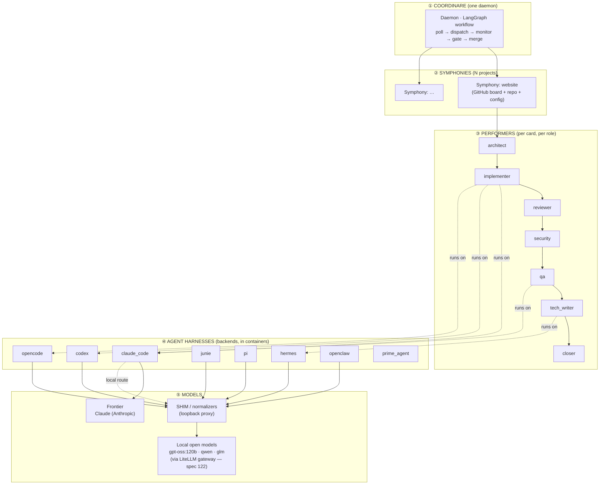

# 02 — Architecture

This is the big picture. Five layers, top to bottom: **Coordinare → Symphonies → Performers →
Harnesses → Models** (with the **Shim** layer sitting between harness and a local model).

## The layered system



**Read it as:** one daemon drives N symphonies; each symphony's card flows through an ordered
sequence of performers; each performer runs on a harness; each harness calls a model — directly
if it's a frontier API, or **through a shim** if it's a local open model.

## How a card moves (orchestration flow)

```mermaid
flowchart LR
  BL["Backlog"] --> TODO["TODO"]
  TODO -->|pickup<br/>(slot free)| IP["IN_PROGRESS"]
  IP --> ARCH["architect → assess →<br/>implement → review →<br/>security → qa → document → close"]
  ARCH -->|CI gate green<br/>all stages pass| IR["IN_REVIEW"]
  IR -->|HUMAN approves<br/>+ base green| MERGE["merge"]
  MERGE --> DONE["DONE"]
  IP -.CI bounce / changes.-> IP
  IP -.infra failure.-> BLK["BLOCKED<br/>(HOLD + notify)"]
  IR -.changes requested.-> IP
  BLK -.blocker cleared<br/>(auto-recovery, spec 129).-> IR
```

- **Board columns** map to workflow phases (TODO → IN_PROGRESS → IN_REVIEW → DONE; BLOCKED is a parking lot).
- **`max_concurrent_cards`** limits how many cards are active at once (a slot model). In-review and blocked cards don't consume a working slot.
- **Bounces** send a card back to the implementer with the failing checks; **infra failures** are parked in BLOCKED (not bounced) and the operator is notified; **only humans approve** the final merge.
- **BLOCKED is no longer a dead end.** Each cycle, before skipping a blocked card, coordinare
  re-evaluates whether its blocker still holds and **auto-recovers** it to the right stage when it
  has cleared — a stale human review now addressed, or a recovered environment (spec 129,
  default-OFF behind `COORDINARE_BLOCKED_RECOVERY`). It never auto-clears a genuine unresolved human
  verdict.

## The harness → shim → model path (local-model parity)

This is the layer most people haven't seen before. An off-the-shelf agent CLI expects a
frontier model's API and behavior. A local model breaks those expectations. The shim makes the
local model *look* frontier-grade to the harness — **without changing the harness**.

```mermaid
flowchart LR
  H["Agent harness<br/>(e.g. junie / claude_code)<br/>POSTs to provider base URL"]
  H -->|provider base URL<br/>repointed to loopback| SH

  subgraph SH["SHIM (127.0.0.1, in-container reverse proxy)"]
    direction TB
    RT{"routing.yaml<br/>(backend,model)<br/>→ strategy"}
    NORM["normalizers<br/>strip_reasoning ·<br/>harmony_tool_calls ·<br/>strip_control_chars"]
    TR["wire translate<br/>Anthropic ⇄ OpenAI<br/>(spec 084)"]
    RT --> NORM --> TR
  end

  SH -->|forward verbatim| UP["Local model upstream<br/>gpt-oss:120b via LiteLLM gateway<br/>OpenAI /v1/chat/completions"]
  UP -->|raw response<br/>(leaks, reasoning, bad JSON)| SH
  SH -->|repaired, frontier-shaped<br/>response| H
```

**Strategies** (chosen per `(backend, model)` in `routing.yaml`):
- **`reroute`** — just repoint the harness at a clean upstream (no shim, no rewriting).
- **`normalize`** — run a loopback shim that *repairs the response* via normalizers.
- **`translate`** — additionally translate wire formats (e.g. Claude Code's Anthropic
  `/v1/messages` ⇄ the model's OpenAI `/v1/chat/completions`).

See **[04 — Harnesses & Shims](04-harnesses-and-shims.md)** for the full normalizer catalog.

## Configuration composition (where behavior comes from)

Behavior is composed from three config surfaces — this is the "configuration compositions" view:

```mermaid
flowchart TB
  subgraph CFG["Configuration surfaces"]
    direction LR
    ENV[".env<br/>secrets · \${VAR}"]
    CY["config.yaml<br/>global defaults +<br/>symphonies[] + overrides +<br/>performers/roles + modes/catalogs"]
    RY["routing.yaml<br/>(backend,model) →<br/>strategy + normalizers"]
  end

  CY -->|effective_config<br/>(global ⊕ symphony override)| EFF["Per-symphony effective config"]
  EFF --> ROLE["role → backend → mode →<br/>model_endpoint → endpoint"]
  ROLE --> DISP["dispatch: which harness,<br/>which model, which container"]
  RY --> SHIMSEL["shim selection at performer launch"]
  ENV -.expanded into.-> CY & RY
```

- **`config.yaml`**: global defaults, the `symphonies[]` list (each can `override` any global
  field), `performers`/`performer_endpoints` (containers, images, roles, env, volumes), per-role
  backend/mode/max_tokens, and the spec-080 catalogs (`endpoints[]`, `model_endpoints[]`,
  `modes[]`).
- **`routing.yaml`**: the self-hosted routing table — maps `(backend, model)` to a strategy +
  normalizers + health probe; this is what activates a shim.
- **`.env`**: secrets, expanded into the YAMLs via `${VAR}` at load time.

Full detail in **[05 — Configuration Compositions](05-configuration.md)**.

## Process & deployment shape

- **One coordinare process** (the daemon) — health on `:9090`, dashboard on `:9091`. Holds
  in-memory + on-disk state (`coordinare.state.json`) so it survives restarts and reconciles
  against the live board.
- **Performers are containers** — built from `coordinare-performer:{base,full,extra}` images.
  `ephemeral` performers are spun up per job and torn down; `subprocess`/`persistent` variants
  exist too. The chosen harness's CLI must be present in the image (`BACKEND` env selects it).
- **Env-cache on the host** — `~/.coordinare/env-caches/<symphony>/` is bind-mounted into
  performers at `/devenv` (rw for bootstrap, ro for everyone else).

Next: **[03 — Performer Lifecycle](03-performer-lifecycle.md)**.
</content>
