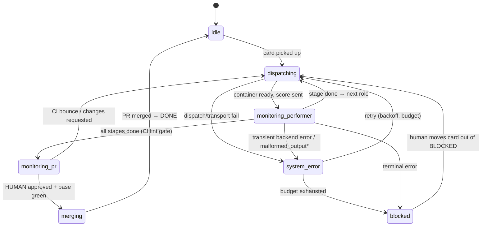

# 03 — Performer Lifecycle

A card flows through an **ordered sequence of roles**, each handled by a freshly dispatched
performer. The order is canonical and **sequential — never parallel** (a stage starts only when
the prior stage succeeds).

## Roles & stages (canonical order)

Source of truth: `src/coordinare/lifecycle.py` (`ROLE_TO_STAGE`, `CANONICAL_ORDER`).

| # | Role | Stage name | What it produces |
|---|---|---|---|
| 1 | `advocate` | `advocate` | indexes issue context (the card's intent) |
| 2 | `assessor` | `assessing` | an assessment of the work |
| 3 | `architect` | `architecting` | plan + tasks committed |
| 4 | `implementer` | `implementing` | code + an opened PR |
| 5 | `reviewer` | `reviewing` | review verdict (approve / changes) |
| 6 | `security` | `security` | security verdict |
| 7 | `qa` | `qa` | QA verdict (runs tests against the live env) |
| 8 | `tech_writer` | `documenting` | docs committed |
| 9 | `closer` | `closing_review` | final close-out review |

> `assessing` and `closing_review` are **singleton stages** (clamped to concurrency 1).
> Not every symphony enables every role — roles are configured per project.

The daemon tracks where a card is via a **`WorkflowPhase`** (in `state_store.py`):
`idle · dispatching · monitoring_performer · monitoring_pr · merging · relay_feedback ·
blocked · recovery · system_error`.

## The board model

A symphony is a **GitHub Projects v2 board**. Columns map to phases:

| Column | Phase(s) | Consumes a slot? |
|---|---|---|
| Backlog | idle | no |
| TODO | dispatching (initial) | yes |
| IN_PROGRESS | dispatching / monitoring_performer | **yes (1 slot)** |
| IN_REVIEW | monitoring_pr / merging | no (passive — awaiting human) |
| BLOCKED | blocked | no (no live performer) |
| DONE | idle | no |

- **Pickup:** `check_board` does a "unified pickup" each cycle, bounded by
  `max_concurrent_cards` via the slot manager. IN_REVIEW and BLOCKED cards don't hold a working
  slot, but the daemon still re-adopts them each cycle.
- **Human approval rule:** in `monitor_pr`, a PR advances to merge only on a **HUMAN** `APPROVED`
  review. Trusted bots may `COMMENT` / `CHANGES_REQUESTED` but cannot approve.

## The dispatch → monitor loop

\* `malformed_output` and transient backend errors route to `system_error` (bounded retry) rather
than terminal-blocking — see spec 098 (assessor) and spec 119 (documenting).

**Dispatch** (`dispatch_performer`): resolve the stage's role → performer endpoint → backend →
model; start the container; wait for readiness; send the "score" (card, issue, persona,
relay-feedback). **Monitor** (`monitor_performer`): poll status; on terminal success advance the
stage (or move to IN_REVIEW); on terminal error block; on transient error retry.

## Gates (the control points)

| Gate | Spec | Fires when | Effect |
|---|---|---|---|
| **CI gate** | 075 / 090 | after a PR exists, and on each new push | `pass` → advance · `hold` → wait for pending checks · `bounce` → back to implementer with failing checks · `escalate` → BLOCKED |
| **Local-test gate** | 089 | implementer's local tests fail | bounded self-fix loop (`max_fix_attempts`, per-HEAD counter) before escalating |
| **Baseline-prevention (L1)** | 090 | about to merge | refuse merge if the **base branch** is red on required checks |
| **Baseline-classification (L2)** | 090 | CI failure | label `inherited` / `introduced` / `flake` / `unknown` / `env_blocked` (observe) |
| **Inherited-repair (L3)** | 090 | inherited failure | bounded autonomous repair (1 attempt/head, audited, never auto-merges) |
| **Env-blocked gate** | 095 / 118 | failure classified as infra (artifact quota, runner perms, offline runner) | **HOLD + notify** the operator — does *not* bounce the implementer |
| **Env-cache readiness / dispatch gate** | 088 / 093 | bootstrap not yet successful | hold card dispatch until the env-cache is ready; circuit-break after N failed bootstraps |

The CI-gate **classification** (090-L2) is what lets coordinare tell "the implementer broke this"
(introduced → bounce) from "the runner is broken" (env_blocked → hold). That distinction is why
a flaky CI runner doesn't endlessly bounce a blameless implementer.

## Resilience: system_error vs terminal

Two failure classes matter:

- **Transient / format-contract errors** (backend CLI crash, transport reset, `malformed_output`
  from a stochastic local model) → routed to `system_error` → **bounded retry** (backoff +
  budget, ~3 attempts) → re-dispatch. Only blocks after the budget is exhausted.
- **Genuine terminal errors / content verdicts** → `blocked` (operator-visible), or a bounce
  back to the implementer.

This is why a single bad roll from a local model (e.g. a malformed JSON response on the
documenting stage) no longer parks a card forever — it retries first (spec 119).

Next: **[04 — Harnesses & Shims](04-harnesses-and-shims.md)**.
</content>
