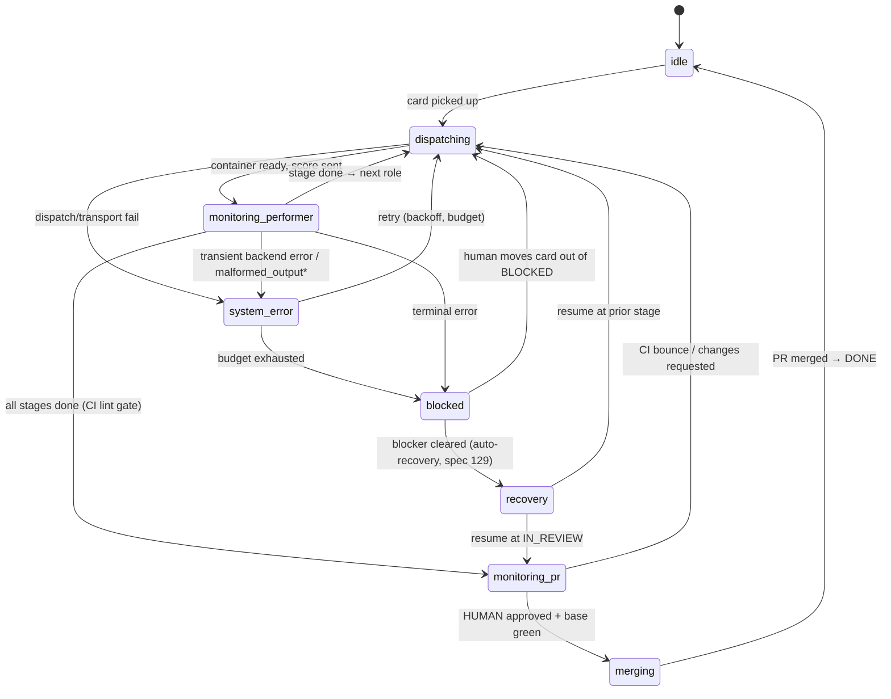

# 03 — Performer Lifecycle

A card flows through an **ordered sequence of roles**, each handled by a freshly dispatched
performer. The order is canonical and **sequential — never parallel** (a stage starts only when
the prior stage succeeds).

## Roles & stages (canonical order)

Source of truth: `src/coordinare/lifecycle.py` (`ROLE_TO_STAGE`, `CANONICAL_ORDER`).

| # | Role | Stage name | What it produces |
|---|---|---|---|
| 1 | `assessor` | `assessing` | an assessment of the work |
| 2 | `architect` | `architecting` | plan + tasks committed |
| 3 | `implementer` | `implementing` | code + an opened PR |
| 4 | `reviewer` | `reviewing` | review verdict (approve / changes) |
| 5 | `security` | `security` | security verdict |
| 6 | `qa` | `qa` | QA verdict (runs tests against the live env) |
| 7 | `tech_writer` | `documenting` | maintains the living project wiki (`docs/wiki/`) — spec 124 |
| 8 | `closer` | `closing_review` | final close-out review |

Two roles run **outside** this lifecycle, on inbound repository issues rather
than on cards: the `advocate` answers questions from the project's own
documentation, and the `curator` proposes ready issues to the board's backlog
for a human to promote. Neither owns a card, and neither appears above.

> `assessing` and `closing_review` are **singleton stages** (clamped to concurrency 1).
> Not every symphony enables every role — roles are configured per project.

The daemon tracks where a card is via a **`WorkflowPhase`** (in `state_store.py`):
`idle · dispatching · monitoring_performer · monitoring_pr · merging · relay_feedback ·
blocked · recovery · system_error`.

## The board model

A symphony is a **GitHub Projects v2 board**. Columns map to phases:

| Column | Phase(s) | Consumes a slot? |
|---|---|---|
| Backlog | idle | no |
| TODO | dispatching (initial) | yes |
| IN_PROGRESS | dispatching / monitoring_performer | **yes (1 slot)** |
| IN_REVIEW | monitoring_pr / merging | no (passive — awaiting human) |
| BLOCKED | blocked / recovery | no (no live performer) |
| DONE | idle | no |

- **Pickup:** `check_board` does a "unified pickup" each cycle, bounded by
  `max_concurrent_cards` via the slot manager. IN_REVIEW and BLOCKED cards don't hold a working
  slot, but the daemon still re-adopts them each cycle.
- **Human approval rule:** in `monitor_pr`, a PR advances to merge only on a **HUMAN** `APPROVED`
  review. Trusted bots may `COMMENT` / `CHANGES_REQUESTED` but cannot approve.
- **BLOCKED auto-recovery (spec 129):** each cycle `check_board` re-evaluates every BLOCKED card
  before skipping it and auto-recovers it when the blocker has demonstrably cleared — a stale human
  review now addressed → IN_REVIEW, or a recovered environment → its prior working stage. Fully
  fail-safe, anti-thrash (one attempt/card/run), one operator notification, and it **never**
  auto-clears a genuine unresolved human verdict. Default-OFF behind `COORDINARE_BLOCKED_RECOVERY`.

## The dispatch → monitor loop

\* `malformed_output` and transient backend errors route to `system_error` (bounded retry) rather
than terminal-blocking — see spec 098 (assessor) and spec 119 (documenting).

**Dispatch** (`dispatch_performer`): resolve the stage's role → performer endpoint → backend →
model; start the container; wait for readiness; send the "score" (card, issue, persona,
relay-feedback). **Monitor** (`monitor_performer`): poll status; on terminal success advance the
stage (or move to IN_REVIEW); on terminal error block; on transient error retry.

## Gates (the control points)

| Gate | Spec | Fires when | Effect |
|---|---|---|---|
| **CI gate** | 075 / 090 | after a PR exists, and on each new push | `pass` → advance · `hold` → wait for pending checks · `bounce` → back to implementer with failing checks · `escalate` → BLOCKED |
| **Local-test gate** | 089 | implementer's local tests fail | bounded self-fix loop (`max_fix_attempts`, per-HEAD counter) before escalating |
| **Baseline-prevention (L1)** | 090 | about to merge | refuse merge if the **base branch** is red on required checks |
| **Baseline-classification (L2)** | 090 | CI failure | label `inherited` / `introduced` / `flake` / `unknown` / `env_blocked` (observe) |
| **Inherited-repair (L3)** | 090 | inherited failure | bounded autonomous repair (1 attempt/head, audited, never auto-merges) |
| **Env-blocked gate** | 095 / 118 | failure classified as infra (artifact quota, runner perms, offline runner) | **HOLD + notify** the operator — does *not* bounce the implementer |
| **Env-cache readiness / dispatch gate** | 088 / 093 | bootstrap not yet successful | hold card dispatch until the env-cache is ready; circuit-break after N failed bootstraps |
| **QA evidence floor** | 120 | a `qa_passed` verdict is unsubstantiated (0-of-N criteria, or missing required visual evidence) | `advance` only if substantiated; else `hold` (env signal) or `bounce` — a self-reported pass is never trusted blindly |
| **QA visual-capture resilience** | 129 | a QA pass is unsubstantiated *only* because the capture tooling was unavailable (not the app) | recoverable **HOLD**, not a hard bounce — never a false-pass (honors the 120 floor). Gated with the recovery flag |
| **Stale-review handling** | 128 | a human `CHANGES_REQUESTED` is stale (its feedback addressed by newer commits / resolved threads) | surface + re-request review, or move back to IN_REVIEW — don't silently sit blocked on an addressed verdict |
| **BLOCKED auto-recovery** | 129 | a BLOCKED card's blocker (stale review / env) has cleared | auto-unblock + route to the correct stage; fail-safe, anti-thrash, never past a live human verdict (default-OFF) |

The CI-gate **classification** (090-L2) is what lets coordinare tell "the implementer broke this"
(introduced → bounce) from "the runner is broken" (env_blocked → hold). That distinction is why
a flaky CI runner doesn't endlessly bounce a blameless implementer.

## Resilience: system_error vs terminal

Two failure classes matter:

- **Transient / format-contract errors** (backend CLI crash, transport reset, `malformed_output`
  from a stochastic local model) → routed to `system_error` → **bounded retry** (backoff +
  budget, ~3 attempts) → re-dispatch. Only blocks after the budget is exhausted.
- **Genuine terminal errors / content verdicts** → `blocked` (operator-visible), or a bounce
  back to the implementer.

This is why a single bad roll from a local model (e.g. a malformed JSON response on the
documenting stage) no longer parks a card forever — it retries first (spec 119).

Next: **[04 — Harnesses & Shims](04-harnesses-and-shims.md)**.
</content>

## Analysis and documentation handoff

With the structured role workflows configured, assessing, architecting, reviewing,
security, and QA report findings rather than writing living documentation. Coordinare
retains a bounded record per role, with its source head and content hash. Reviewer
and security records are independent. A new dispatch clears that role's prior record;
raw command outputs are not copied into this documentation carrier.

The architect's documentation brief starts an early documenter alongside implementation.
It uses the symphony's configured documenting workflow, model, tuning, and GitHub URLs.
New completed findings schedule another update after the current writer finishes.
Early runs write under `docs/`; the final documenting stage reconciles the implemented
head and updates root pointers. Existing pages are read and integrated rather than
repeated as new pages. The documenter verifies earlier analysis against the checkout. Structured inputs share
the configured gather evidence budget, with at most 4,000 characters divided across
the five roles; clipped records retain their role and source-head attribution.
An implementer receives completed documentation paths and their head when available;
the structured implementation brief remains authoritative and implementation does not
wait for prose.

Only one documenter writes a card at a time. Final documentation waits for an active
early run. After restart, persistent services resume polling and Docker ephemeral jobs
are adopted through startup reconciliation. Confirmed absent or stopped Docker writers
release the lock. Unknown status or an unconfirmed stop preserves the writer lock and
blocks final documentation; verify the remote writer has stopped before operator recovery.
Docker enumeration cannot establish whether a Kubernetes writer is absent, so that
case retains the lock until status can be confirmed. Status probes remain bounded even
after the job's one-hour observation budget expires.

Snapshot schema 22 stores these records; older snapshots load empty findings. Legacy
prose roles and `architecture_plan_path` remain supported. Configure the structured
workflows to use the single-author path; this change does not enable workflows by default.
