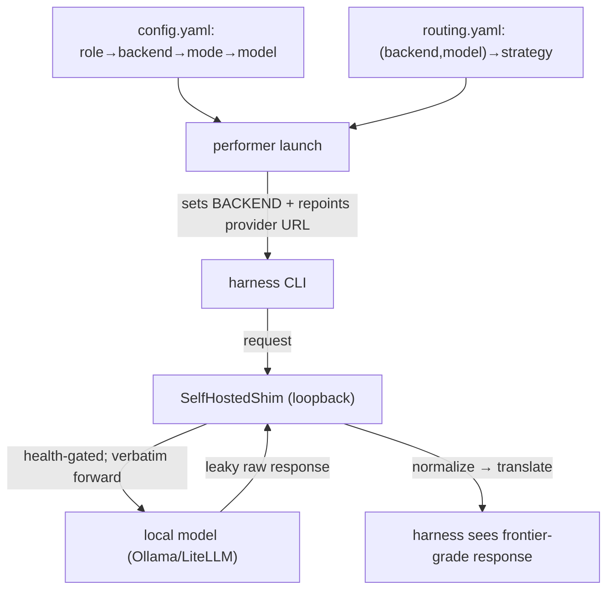

# 04 — Harnesses & Shims

This is the layer that lets coordinare run **off-the-shelf agent CLIs against local open models**
as if they were frontier models. Two parts: the **harnesses** (the CLIs performers run) and the
**shim layer** (what makes a local model behave correctly for those CLIs).

## Agent harnesses (backends)

A performer runs exactly one **backend** — an agent harness CLI — selected by the `BACKEND`
env var at container start (`get_backend(name)` in `agent/performer/src/performer/backends/`).

| Backend | Harness type | Wire format | Notes |
|---|---|---|---|
| `claude_code` | interactive CLI (stream-json) | Anthropic | native Claude; can be routed to local via spec-084 translate |
| `opencode` / `opencode_compat` | HTTP server + SSE | OpenAI | the proven, leak-free harness used for env-bootstrap |
| `codex` | WebSocket JSON-RPC | OpenAI (Responses API) | |
| `junie` | one-shot CLI | OpenAI | JetBrains agent; JSON-only roles; non-tool-calling |
| `pi` | one-shot CLI (JSON lines) | OpenAI | |
| `hermes` | one-shot CLI | OpenAI | used for `tech_writer` (documenting); strict JSON parser |
| `openclaw` | one-shot CLI (embedded agent) | OpenAI | |

**Why multiple harnesses?** Different harnesses have different strengths, tool-calling styles,
and failure modes. Coordinare assigns harnesses **per role** so each stage uses the one that
works best for it (e.g. `opencode` for bootstrap, `hermes` for documenting, `claude_code` for
QA). This is the "performers may run different agent harnesses" point.

### How role → backend → model is resolved

```
role (e.g. tech_writer)
  └─ performers.<role>.backend           → which harness (hermes)
  └─ performers.<role>.mode              → spec-080 mode (e.g. single-gptoss120)
        └─ modes[].tool → model_endpoints[] → endpoints[]   → which model + base_url
```

At dispatch, coordinare resolves the concrete `{model, base_url, api_key_env}` and sets the
container's `BACKEND` + provider env. The performer's harness then talks to that endpoint.

## The shim layer — why it exists

An agent harness was built expecting a **frontier model**: clean tool-calls, no visible
"thinking," valid JSON, the right wire format. A **local open model** violates all of these:

- it **leaks its reasoning channel** into the answer,
- it **mangles tool calls** (gpt-oss "harmony" channel leaks as text instead of structured calls),
- it emits **unescaped control characters** that break strict JSON parsers,
- it speaks **OpenAI wire** when the harness (Claude Code) speaks **Anthropic wire**.

The **shim** is a tiny in-container reverse proxy on `127.0.0.1` that the harness's provider base
URL is repointed to. It **forwards requests verbatim** and **repairs responses** so the harness
sees frontier-grade output. The harness is unmodified — it doesn't know a shim is there.

Two shim classes:
- **`SelfHostedShim`** (spec 078) — the normalize/translate reverse proxy described here.
- **`DualModelProxy`** (spec 080) — orchestrates a *thinking* model + a *tool* model within one
  turn (strategies `single` / `always` / `conditional` / `think_once`). Out of scope here; see
  spec 080.

## Routing strategies (`routing.yaml`)

`routing.yaml` (`selfhosted_routing`) maps a `(backend, model)` pair to a **`TargetDescriptor`**:
`base_url`, `wire_format` (openai|anthropic), `strategy`, `normalizers[]`, `health_probe`,
optional `upstream_model` / `reroute_upstream`.

| Strategy | What it does | Shim launched? | Normalizers? |
|---|---|---|---|
| **`reroute`** | repoint the harness's provider env straight at a clean upstream | no | not allowed |
| **`normalize`** | loopback shim forwards verbatim, **repairs the response** via normalizers | yes | required |
| **`translate`** | as normalize, **plus** wire-format translation (Anthropic `/v1/messages` ⇄ OpenAI `/v1/chat/completions`) — spec 084 | yes | optional |

**Health probes** (spec 099) gate the shim at startup (the only fail-closed surface):
- `tool_call` (default) — require a structured tool-call to a trivial ping (catches harmony/reasoning leaks),
- `completion` — require non-empty normalized text (for non-tool-calling harnesses like junie/hermes).

If the probe fails and `reroute_upstream` is set, it auto-reroutes to the clean upstream; else
the card isn't accepted. Decisions are logged (no token/body content).

## Normalizers — the local→frontier repairs

Each normalizer is a **pure, fail-open transform** keyed by output pathology (in
`agent/performer/src/performer/proxy/normalizers/`). They run on **both JSON and SSE** paths;
an unrecognized shape passes through unchanged.

| Normalizer | Key | Repairs |
|---|---|---|
| **Harmony tool-calls** | `harmony_tool_calls` | gpt-oss's "harmony" commentary channel leaking as assistant *text* (`<\|channel\|>commentary to=functions.x …`) instead of a structured `tool_calls` entry — reassembles it into a proper OpenAI tool call. |
| **Strip reasoning** | `strip_reasoning` | reasoning/"thinking" blocks leaking into the answer (Anthropic `thinking` blocks; OpenAI `reasoning_content`). Removes them; if the answer was *reasoning-only*, promotes the reasoning to content so it isn't empty. |
| **Strip control chars** | `strip_control_chars` | unescaped control bytes (< 0x20) inside JSON strings that make the *whole* body unparseable — strips them **before** `json.loads` (spec 098). |

Composition example (the `tech_writer`/hermes path, spec 100):
```yaml
- backend: hermes
  model: gpt-oss:120b
  target:
    base_url: http://<litellm-host>:4000   # LiteLLM gateway (spec 122), not Ollama-direct
    wire_format: openai
    strategy: normalize
    health_probe: completion
    normalizers: [strip_control_chars, strip_reasoning]
```
This lets a reasoning model's output reach hermes's strict JSON parser as clean JSON. (Residual
stochastic malformed output is handled one level up by the spec-119 retry, not the shim.)

## Models

- **Frontier:** Claude (Anthropic) via `claude_code` native — no shim on the native path.
- **Local / self-hosted:** `gpt-oss:120b`, `qwen` variants, `glm` — served through the
  **LiteLLM gateway** (spec 122), an OpenAI-compatible front door (`/v1/chat/completions`) that
  fronts the underlying Ollama/vLLM backends. **All self-hosted inference now goes through this
  one gateway** — coordinare no longer calls Ollama hosts (the "the model host" boxes) directly, so there's
  a single place to route, observe, and swap models. These are the paths that need the shim +
  normalizers to behave like frontier models. (During the 122 cutover a few one-shot harnesses —
  junie/pi/hermes — needed CLI-compat fixes; the routing direction is LiteLLM-for-all.)

### Provider base-URL env per backend
The launcher repoints exactly one env var per backend to the loopback shim (then restores it on
stop): `ANTHROPIC_BASE_URL` (claude_code), `CODEX_PROVIDER_BASE_URL`, `OPENCODE_PROVIDER_BASE_URL`,
`JUNIE_PROVIDER_BASE_URL`, `PI_PROVIDER_BASE_URL`, `OPENCLAW_PROVIDER_BASE_URL`, `HERMES_BASE_URL`.

## Role workflows (spec 164)

A **harness** runs a general-purpose coding agent and hands it a persona. That is
the right shape for "implement this card". It is the wrong shape for QA, which is
a multi-step reasoning job — read the diff, decide what to check, boot the app,
check it, compare before and after, judge — and which had been compressed into
one prompt plus ~500 lines of post-hoc parsing in `main.py`.

A **role workflow** sits between the coordinare/performer contract and the work.
It runs entirely inside the performer, presented to `main.py` as an ordinary
`BackendAdapter` (`workflows/adapter.py`), so dispatch, the monitor loop, role
post-processing and cleanup are untouched. Coordinare still sends one task and
receives one response.

QA is the first workflow (`workflows/qa/`): **plan → boot → baseline → execute →
observe → judge → report**. The organising rule is *the model plans and
witnesses; code decides and verifies*. Anything the DOM, an exit code or a file
on disk can answer is taken from there; a criterion passes only when bound to an
executed check with a real exit code. The baseline boots the merge-base commit
as a second process from a git worktree, so a before/after DOM comparison can
catch a field that silently disappeared. QA also emits a structured repair brief
(`qa_findings`) that is rendered into the next implementer's prompt.

Turning it on is per role and default-off:

```yaml
performers:
  qa:
    workflow: qa
    workflow_env:                      # how the app under test boots
      PORT: 3000
      QA_APP_START_COMMAND: "bin/rails s -b 127.0.0.1 -p 3000 -e test"
      QA_APP_SEED_COMMAND: "bin/rails db:migrate db:seed"
      QA_APP_BOOT_TIMEOUT: 180
```

The boot env is layered: process env, then the env cache's activation delta
(`activate.sh` — `PORT`, toolchain `PATH`, `POSTGRESQL_*`/`REDIS_*`), then
`workflow_env`, which wins. `QA_APP_START_COMMAND` is needed whenever
`infer_app_start_command` (Rails, Django, Node only) cannot recognise the
project. Removing the `workflow:` line restores the single-prompt path exactly.

Two things to know when it misbehaves. Every step emits a `BackendEvent`
(`qa.plan`, `qa.boot`, …) so the dashboard shows where a run is, and
`workflow_metrics` on the report carries model-call, retry and per-step timing
counts. And a boot failure names the setting that fixes it — a missing `PORT`,
an unrecognised project, a crashed process and a slow start are four different
problems and are reported as four different reasons.

The scenario eval (`python -m coordinare.eval.qa_scenarios`) scores the workflow
against six generated repositories with a live model. It is a measurement, not a
CI gate: see `tests/eval/qa_scenarios/README.md` for why, and do not wire it into
CI.

### The architect workflow and the blueprint hand-off (spec 165)

The second consumer of the layer. The architect had a prose contract (write
`plan.md` and `tasks.md`), and on the live fleet it drifted into implementer
work: 55 tool calls, a migration, `bundle install`, and no plan after two hours.
`workflow: architect` replaces that with five steps that only code advances:

1. **intake**: card, criteria, the assessment, answered clarifications, the repo's agent instructions. No model call.
2. **survey**: the model proposes read-only commands; an allow-list (`workflows/architect/allowlist.py`) runs only `ls`, `cat`, `head`, `tail`, `sed -n`, `rg`, `grep`, `find` (no `-exec`/`-delete`), `wc`, and read-only `git`. Twelve commands, 4000 characters each; refusals are recorded and still cost budget.
3. **blueprint**: one schema-guarded call producing milestones, modules, data model changes, interfaces, risks, testable criteria and documentation topics, every list and string bounded.
4. **size**: a pure function. One milestone with no data model or interface change is small.
5. **report**: the blueprint plus an executed `git status --porcelain` proving the tree is clean. A dirty tree is an error, not a plan.

The architect commits nothing. Coordinare lifts the blueprint into the card's
session (persisted, schema v17) and slices it at dispatch: the implementer gets
the implementation brief (and a SINGLE TURN note when small), the documenter
gets the documentation brief, QA gets the verification brief and plans from
those criteria. No reader sees another reader's slice, and the implementer no
longer writes documentation of any kind.

The documenter runs as a **side run** beside the lifecycle (the env-bootstrap
and wiki-init pattern), dispatched once per blueprint hash as soon as the card
passes architecting and the brief is non-empty, concurrently with
implementation. It may commit only under the documentation tree (`docs/` by
default, `DOCUMENTER_TREE` to change it). Because two performers now share one
branch, `push_branch` fetches and rebases onto the remote before pushing and
never force-pushes over a divergence; `--force` survives only for the first
push of a branch the remote does not have.

Turning it on:

```yaml
performers:
  architect:
    workflow: architect
```

### Role workflows: assessor (spec 166)

The assessor had a prose contract (write `assessment.md` on the branch), and on
the live fleet it drifted: the assessor commits a second documentation file
beside the documenter, and the structured assessment never reaches the architect.
`workflow: assessor` replaces that with four steps that only code advances:

1. **intake**: card, its clarification history, prior assessor answers from
   earlier bounces. No model call.
2. **assess**: one schema-guarded call producing a goal, expected behaviour,
   out-of-scope items, questions, assumptions, and outcome-level criteria when
   the card has none, every list and string bounded.
3. **gate**: code-driven rules that keep at most two questions, drop questions
   already answered (with 60 percent token overlap), turn remaining questions
   into assumptions after the card's second answered clarification round, and
   always report ready after that round or if no usable question remains.
4. **report**: when ready, the assessment plus a round record; when not ready,
   the gated questions and a blocked status. Nothing is committed.

The assessor commits nothing. Coordinare lifts the assessment into the card's
session (persisted, schema v18) and injects it only into the architecting
dispatch, where the spec 165 architect intake renders it as the first section:
the goal, expected behaviour, out-of-scope items, answered clarifications,
assumptions, and draft criteria (the architect refines criteria into the
verification brief). The clarification loop is bounded by code: at most two
questions per round, never the same question twice, at most two blocking rounds
per card.

Turning it on:

```yaml
performers:
  assessor:
    workflow: assessor
```

### Role workflows: implementer (spec 167)

The implementer was one long harness run: codex or claude_code with a persona
and, since spec 165, an implementation brief, policed only after the fact by the
070 commit floor, the 072 checkpoint, the 089 local gate and the 075 CI fix
loop. `workflow: implementer` moves the loop into code, one blueprint milestone
at a time:

1. **intake, plan, baseline**: milestones from the implementation brief (or the
   whole card as one milestone when there is no brief or the size rule marked it
   single-turn); the project's test command runs once to record what passes.
2. **tests turn, red check**: the harness is asked for the failing tests of this
   milestone only. Code runs the tests: at least one changed test file must
   fail and nothing from the baseline may break. Tests that pass without the
   code get one reprompt; a second miss fails the milestone. Code commits
   `test(#n): failing tests for <goal>`.
3. **implementation turn, green check**: the harness gets the failing test
   names and the excerpt; code runs the tests again; up to three attempts, each
   with the fresh excerpt; code commits `feat(#n): <goal>` and the baseline
   grows. A milestone that will not go green ends the run as partial progress
   at the last green commit, nothing pushed.
4. **quality**: the detected lint command plus `QUALITY_COMMANDS` from the
   role's `workflow_env`, in order; a failure gets a repair turn with the tool's
   output, then the tests and the whole set run again; at most two repairs.
5. **local gate, push, PR**: the 089 gate unchanged, the 165 push path (fetch,
   rebase, never force), the PR opened or updated without reporting `pr_opened`.
6. **CI wait**: the checks are polled; a red check gets a repair turn with the
   failing job's log excerpt, then tests, quality, push and another poll; at
   most three repairs, and the same failing checks twice in a row stop early.
   Checks pending past the wait budget are an environment hold, not a code
   failure. Only green CI reports `pr_opened`, so the reviewer sees a PR whose
   checks already pass.

Every turn is a bounded harness session with a narrow persona; a tests turn may
touch only test paths and no turn may touch `docs/` (out-of-scope edits are
reverted by code and recorded). Commits are written by code, and any commit the
harness makes is squashed into the step's commit.

Turning it on, with the caps the run obeys:

```yaml
performers:
  implementer:
    workflow: implementer
    workflow_env:
      QUALITY_COMMANDS: |
        bundle exec rubocop
      IMPL_TURN_TIMEOUT_S: "1200"
```

Keep `dispatcher_dedup.stall_timeout_seconds` at or above the turn timeout: the
077 stall watchdog kills a working turn that shows no event growth for that
long, and although the workflow forwards the harness's progress, the two
settings should not disagree.

### Role workflows: reviewer (spec 169)

The reviewer was one prompt over the diff whose JSON verdict either parsed or
fell back to prose. `workflow: reviewer` moves the review into code:

1. **intake**: the injected diff is parsed into changed files with new-side hunk
   ranges; a truncated diff is recorded; the relayed open comments are
   normalised to id, path, line and body; the implementation brief is carried.
2. **survey**: the spec-165 allow-list and survey step, with coverage tracking.
   A changed file counts as read when it was fully in the diff or an admitted
   command opened it. A truncated diff or an unread file gets exactly one more
   survey turn naming the unread files.
3. **findings**: one schema-guarded model call. Each finding carries a path, a
   new-side line, a category from the fixed set, the problem, why it blocks,
   and the offending line as evidence. The schema forbids a verdict.
4. **gate**: pure rules. A finding whose path is not a changed file, whose line
   is outside the hunks of a file the survey did not open, or whose evidence
   matches no diff or survey line is dropped and re-anchored once. Every open
   comment without a disposition becomes an `unaddressed_feedback` finding.
   With a brief present, a documentation edit becomes a
   `documentation_by_implementer` finding. Any surviving finding is changes
   requested; none is approved, and approval also needs every changed file
   read, otherwise the run ends as an environment hold naming the unread files.
5. **post**: exactly one GitHub review, `REQUEST_CHANGES` with an inline comment
   per finding inside a hunk (the rest in the body) or `COMMENT` when clean.
   Fixed dispositions are named in the body. No thread is resolved.
6. **report**: the review record with the executed write-free check
   (`git status --porcelain` through the toolkit).

Coordinare lifts the findings into the card session (schema v19), clears them
when the reviewer is dispatched again, and injects them into the implementer
dispatch only. The spec-167 implementer then selects a `repair` lane: one
bounded turn per file group of findings carrying them verbatim, the milestone
tests after each turn, then the usual quality, push, PR and CI path. The
categories are a parameter of the workflow so the security role can reuse it.

```yaml
performers:
  reviewer:
    workflow: reviewer
    workflow_env:
      REVIEWER_SURVEY_MAX_COMMANDS: "12"
```

### Role workflows: security (spec 170)

The security stage was one prose taint analysis whose severity and routing came
from the model, with coordinare running semgrep and bandit at dispatch as a floor
and merging afterwards. `workflow: security` moves the whole stage into code, as
a sibling of the reviewer workflow:

1. **intake**: the injected diff parsed into changed files with new-side hunks;
   truncation recorded; the implementation brief carried. No prior-comment
   dispositions: each round scans fresh.
2. **scan**: semgrep and bandit run inside the performer over the changed files,
   normalised exactly as coordinare's spec-083 scanner does (a parity test holds
   the two copies equal). A missing binary, a crash, a timeout or unparseable
   output ends the round as an environment hold naming the tool, before any
   model call. Fail closed: no scan, no pass.
3. **survey**: the reviewer's allow-listed survey with coverage tracking and one
   coverage pass, seeded with the changed files and the scan findings.
4. **findings**: one schema-guarded call over a fixed category set (injection,
   broken_authorization, hardcoded_secret, insecure_deserialization,
   path_traversal, ssrf, weak_crypto, missing_hardening, information_leak,
   other_insecure_pattern). Each finding names the line, verbatim evidence and
   the changed file that introduces the path. The schema forbids severity,
   routing and verdict keys.
5. **gate**: pure rules. A finding may anchor in a changed file or in any file
   the survey opened (a sink reached from a changed source), but its
   `introduced_by` must be a changed file and its evidence must match a diff or
   survey line; dropped findings get one re-anchor call. Severity comes from the
   category table (hardcoded_secret critical; injection, broken_authorization,
   insecure_deserialization, path_traversal, ssrf high; the rest medium) and
   routing too (broken_authorization to the architect). A `downgrade_reason` on a
   model finding in a blocking category lowers it to advisory and is recorded.
   Scanner findings join with the tool's severity and can never be dropped. Any
   blocking finding is `security_failed`; none is `security_passed`, which also
   needs every changed file read.
6. **post**: exactly one GitHub review, `REQUEST_CHANGES` with inline comments
   for blocking findings inside hunks or `COMMENT` listing the advisories. The
   committed `security.md` and the per-finding advisory comments are retired.
7. **report**: the security record with the executed write-free check.

main.py maps the record onto `security_passed`, `security_failed` (findings in
the spec-022 shape, so coordinare's routing to implementer or architect is
unchanged) or `env_blocked`. Coordinare skips its dispatch-time scan and the
monitor floor merge for a role that runs the workflow, and lifts the blocking
implementer-routed findings into the same `review_findings` carrier the
reviewer uses, so the spec-167 repair lane fixes them.

```yaml
performers:
  security:
    workflow: security
    workflow_env:
      SECURITY_SEMGREP_CONFIG: "auto"
```

`auto` fetches rules from the semgrep registry; a container without egress
fails the scan and the card holds. Point the env at `p/default` or a local rules
directory for an offline fleet.

### Role workflows: closer (spec 172)

The closer shares the reviewer's code path and spends a full model turn
re-reading a pull request to answer a question GitHub already stores per
thread. `workflow: closer` makes it the first workflow whose common path makes
no model call:

1. **intake**: every review thread of the PR, paged, with its resolved and
   outdated flags, path, line and full comment transcript.
2. **classify** (pure rules): `resolved` when GitHub says so; `stale` when it is
   unresolved and outdated, which means the lines it anchored to have changed;
   `answered` when the last comment is by someone other than the raiser and is
   not earlier than the first; `open` otherwise.
3. **judge**: at most one schema-guarded call, only over the answered threads,
   returning per thread addressed with a verbatim quote, or not addressed with
   a reason. Skipped entirely when nothing is ambiguous.
4. **gate**: a judgement about a thread nobody sent is discarded, and an
   addressed judgement whose quote appears in no comment of that thread is
   discarded; the thread then stays open. The verdict is code: any open thread
   is changes requested.
5. **post**: exactly one COMMENT review naming what was resolved and what
   remains, before anything is resolved, so a failed post leaves the PR
   untouched.
6. **act**: on approval only, the stale and addressed threads are resolved
   through the shared helper. A failed resolution turns the verdict into a
   hold: a card never advances carrying a thread the closer believed closed.

Remote CI is never read here. Spec 064's rollup gate runs after approval, and
closers rejecting on pending checks is the bounce loop that gate exists to
prevent.

```yaml
performers:
  closer:
    workflow: closer
```

## The end-to-end picture



**Takeaway:** the harness is generic and unmodified; `routing.yaml` + the shim + normalizers are
what let a local open model meet the harness's frontier-model expectations.

Next: **[05 — Configuration Compositions](05-configuration.md)**.
</content>
