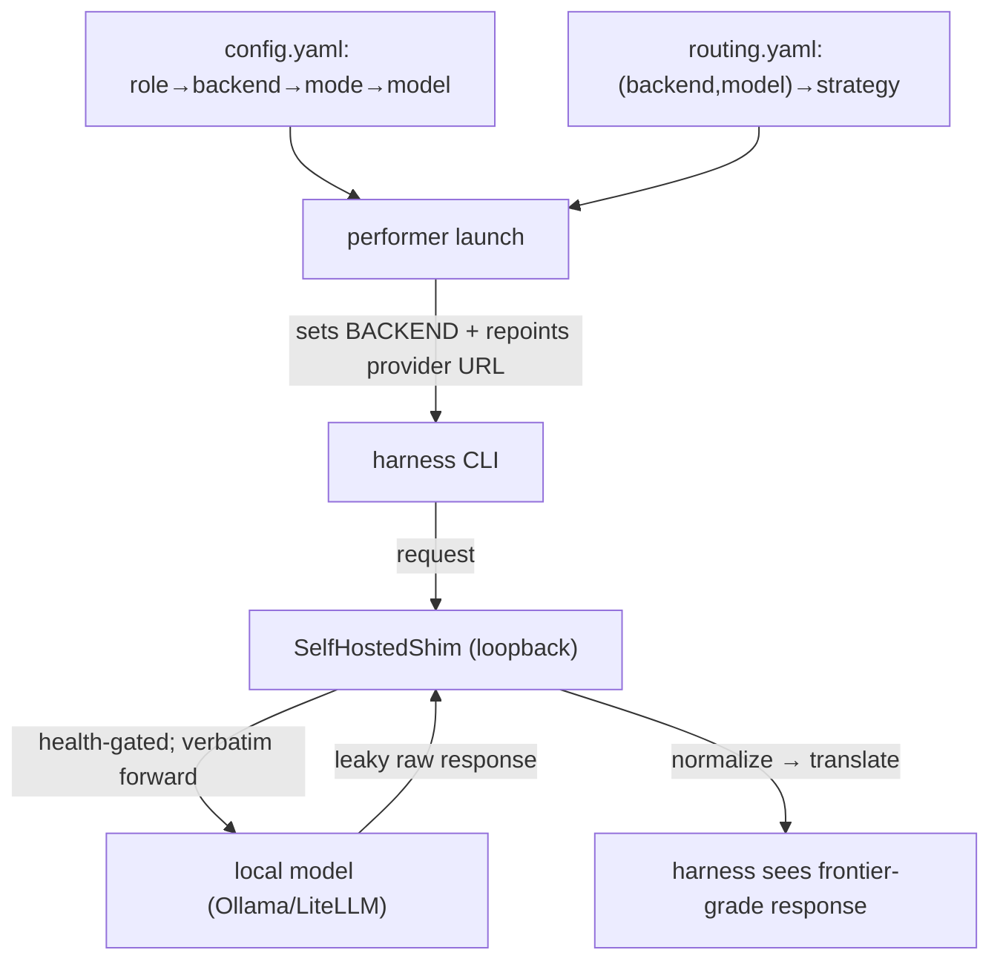

# 04 — Harnesses & Shims

This is the layer that lets coordinare run **off-the-shelf agent CLIs against local open models**
as if they were frontier models. Two parts: the **harnesses** (the CLIs performers run) and the
**shim layer** (what makes a local model behave correctly for those CLIs).

## Agent harnesses (backends)

A performer runs exactly one **backend** — an agent harness CLI — selected by the `BACKEND`
env var at container start (`get_backend(name)` in `agent/performer/src/performer/backends/`).

| Backend | Harness type | Wire format | Notes |
|---|---|---|---|
| `claude_code` | interactive CLI (stream-json) | Anthropic | native Claude; can be routed to local via spec-084 translate |
| `opencode` / `opencode_compat` | HTTP server + SSE | OpenAI | the proven, leak-free harness used for env-bootstrap |
| `codex` | WebSocket JSON-RPC | OpenAI (Responses API) | |
| `junie` | one-shot CLI | OpenAI | JetBrains agent; JSON-only roles; non-tool-calling |
| `pi` | one-shot CLI (JSON lines) | OpenAI | |
| `hermes` | one-shot CLI | OpenAI | used for `tech_writer` (documenting); strict JSON parser |
| `openclaw` | one-shot CLI (embedded agent) | OpenAI | |

**Why multiple harnesses?** Different harnesses have different strengths, tool-calling styles,
and failure modes. Coordinare assigns harnesses **per role** so each stage uses the one that
works best for it (e.g. `opencode` for bootstrap, `hermes` for documenting, `claude_code` for
QA). This is the "performers may run different agent harnesses" point.

### How role → backend → model is resolved

```
role (e.g. tech_writer)
  └─ performers.<role>.backend           → which harness (hermes)
  └─ performers.<role>.mode              → spec-080 mode (e.g. single-gptoss120)
        └─ modes[].tool → model_endpoints[] → endpoints[]   → which model + base_url
```

At dispatch, coordinare resolves the concrete `{model, base_url, api_key_env}` and sets the
container's `BACKEND` + provider env. The performer's harness then talks to that endpoint.

## The shim layer — why it exists

An agent harness was built expecting a **frontier model**: clean tool-calls, no visible
"thinking," valid JSON, the right wire format. A **local open model** violates all of these:

- it **leaks its reasoning channel** into the answer,
- it **mangles tool calls** (gpt-oss "harmony" channel leaks as text instead of structured calls),
- it emits **unescaped control characters** that break strict JSON parsers,
- it speaks **OpenAI wire** when the harness (Claude Code) speaks **Anthropic wire**.

The **shim** is a tiny in-container reverse proxy on `127.0.0.1` that the harness's provider base
URL is repointed to. It **forwards requests verbatim** and **repairs responses** so the harness
sees frontier-grade output. The harness is unmodified — it doesn't know a shim is there.

Two shim classes:
- **`SelfHostedShim`** (spec 078) — the normalize/translate reverse proxy described here.
- **`DualModelProxy`** (spec 080) — orchestrates a *thinking* model + a *tool* model within one
  turn (strategies `single` / `always` / `conditional` / `think_once`). Out of scope here; see
  spec 080.

## Routing strategies (`routing.yaml`)

`routing.yaml` (`selfhosted_routing`) maps a `(backend, model)` pair to a **`TargetDescriptor`**:
`base_url`, `wire_format` (openai|anthropic), `strategy`, `normalizers[]`, `health_probe`,
optional `upstream_model` / `reroute_upstream`.

| Strategy | What it does | Shim launched? | Normalizers? |
|---|---|---|---|
| **`reroute`** | repoint the harness's provider env straight at a clean upstream | no | not allowed |
| **`normalize`** | loopback shim forwards verbatim, **repairs the response** via normalizers | yes | required |
| **`translate`** | as normalize, **plus** wire-format translation (Anthropic `/v1/messages` ⇄ OpenAI `/v1/chat/completions`) — spec 084 | yes | optional |

**Health probes** (spec 099) gate the shim at startup (the only fail-closed surface):
- `tool_call` (default) — require a structured tool-call to a trivial ping (catches harmony/reasoning leaks),
- `completion` — require non-empty normalized text (for non-tool-calling harnesses like junie/hermes).

If the probe fails and `reroute_upstream` is set, it auto-reroutes to the clean upstream; else
the card isn't accepted. Decisions are logged (no token/body content).

## Normalizers — the local→frontier repairs

Each normalizer is a **pure, fail-open transform** keyed by output pathology (in
`agent/performer/src/performer/proxy/normalizers/`). They run on **both JSON and SSE** paths;
an unrecognized shape passes through unchanged.

| Normalizer | Key | Repairs |
|---|---|---|
| **Harmony tool-calls** | `harmony_tool_calls` | gpt-oss's "harmony" commentary channel leaking as assistant *text* (`<\|channel\|>commentary to=functions.x …`) instead of a structured `tool_calls` entry — reassembles it into a proper OpenAI tool call. |
| **Strip reasoning** | `strip_reasoning` | reasoning/"thinking" blocks leaking into the answer (Anthropic `thinking` blocks; OpenAI `reasoning_content`). Removes them; if the answer was *reasoning-only*, promotes the reasoning to content so it isn't empty. |
| **Strip control chars** | `strip_control_chars` | unescaped control bytes (< 0x20) inside JSON strings that make the *whole* body unparseable — strips them **before** `json.loads` (spec 098). |

Composition example (the `tech_writer`/hermes path, spec 100):
```yaml
- backend: hermes
  model: gpt-oss:120b
  target:
    base_url: http://<litellm-host>:4000   # LiteLLM gateway (spec 122), not Ollama-direct
    wire_format: openai
    strategy: normalize
    health_probe: completion
    normalizers: [strip_control_chars, strip_reasoning]
```
This lets a reasoning model's output reach hermes's strict JSON parser as clean JSON. (Residual
stochastic malformed output is handled one level up by the spec-119 retry, not the shim.)

## Models

- **Frontier:** Claude (Anthropic) via `claude_code` native — no shim on the native path.
- **Local / self-hosted:** `gpt-oss:120b`, `qwen` variants, `glm` — served through the
  **LiteLLM gateway** (spec 122), an OpenAI-compatible front door (`/v1/chat/completions`) that
  fronts the underlying Ollama/vLLM backends. **All self-hosted inference now goes through this
  one gateway** — coordinare no longer calls Ollama hosts (the "the model host" boxes) directly, so there's
  a single place to route, observe, and swap models. These are the paths that need the shim +
  normalizers to behave like frontier models. (During the 122 cutover a few one-shot harnesses —
  junie/pi/hermes — needed CLI-compat fixes; the routing direction is LiteLLM-for-all.)

### Provider base-URL env per backend
The launcher repoints exactly one env var per backend to the loopback shim (then restores it on
stop): `ANTHROPIC_BASE_URL` (claude_code), `CODEX_PROVIDER_BASE_URL`, `OPENCODE_PROVIDER_BASE_URL`,
`JUNIE_PROVIDER_BASE_URL`, `PI_PROVIDER_BASE_URL`, `OPENCLAW_PROVIDER_BASE_URL`, `HERMES_BASE_URL`.

## The end-to-end picture



**Takeaway:** the harness is generic and unmodified; `routing.yaml` + the shim + normalizers are
what let a local open model meet the harness's frontier-model expectations.

Next: **[05 — Configuration Compositions](05-configuration.md)**.
</content>
