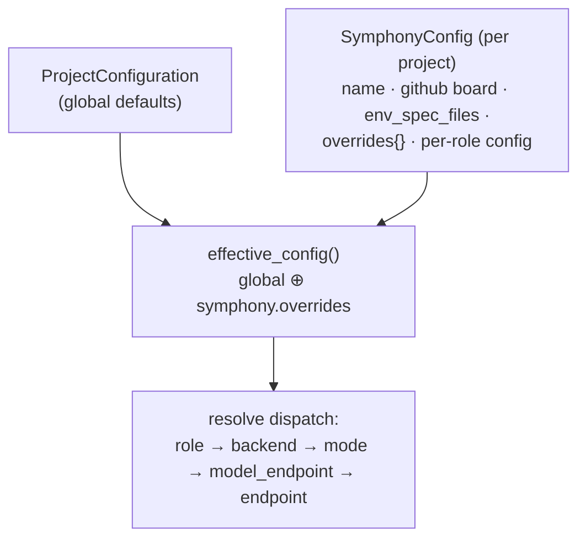

# 05 — Configuration Compositions

Coordinare's behavior is **composed** from three config surfaces. Understanding how they layer is
the key to deploying it to a new project or changing how a role runs.

## The three surfaces

| File | Owns | Loaded by |
|---|---|---|
| **`config.yaml`** | global defaults, `symphonies[]`, performers/endpoints, per-role backend/mode, spec-080 catalogs, gates | `src/coordinare/config.py` (`CoordinareConfiguration`) |
| **`routing.yaml`** | self-hosted routing table — `(backend, model)` → strategy + normalizers | `proxy/routing.py` (mounted into performers) |
| **`.env`** | secrets; expanded into the YAMLs via `${VAR}` at load time | shell + `from_yaml()` |

All three are **gitignored** (deployment-specific); `config.example.yaml` / `routing.example.yaml`
are the checked-in templates.

> ⚠️ **Always** `set -a && source .env && set +a` before launching — `${VAR}` placeholders in
> `config.yaml` expand at load time and silently become empty strings otherwise.

## Layer 1–2–3: global → symphony → effective



- **`ProjectConfiguration`** is the singleton template applied to every symphony.
- **`SymphonyConfig`** wraps a project and may `override` any global field *for that symphony only*.
- **`effective_config()`** merges them (preserving "explicitly set vs inherited" so per-role
  fields resolve correctly).
- **`CoordinareConfiguration`** is the root: `{ global_config, symphonies[], orchestra, dispatcher_dedup }`.

### Shape of `config.yaml`

```yaml
github_org: "ViviDynamics"
github_token: "${GH_TOKEN}"
human_reviewers: ["jason@…"]        # only these can APPROVE PRs
max_concurrent_cards: 5             # global default

# --- spec-080 model catalogs (unify single/dual/self-hosted/frontier) ---
# spec-122: self-hosted models are served behind ONE LiteLLM gateway (kind:
# litellm) — coordinare no longer points at Ollama/Spark hosts directly.
endpoints:                          # named serving locations
  - name: litellm
    kind: litellm
    base_url: http://<litellm-host>:4000/v1
    auth_env: LITELLM_API_KEY       # NAME of env var, never the secret
model_endpoints:                    # (model @ endpoint) pairs
  - name: gptoss120
    endpoint: litellm
    model: gpt-oss:120b
modes:                              # orchestration strategies
  - name: single-gptoss120
    strategy: single                # single | always | conditional | think_once
    tool: gptoss120

# --- containerized performers (spec 056) ---
performer_endpoints:
  - id: hermes-ephemeral
    mode: ephemeral                 # ephemeral | persistent | subprocess
    image: coordinare-performer:full
    roles: [ tech_writer ]
    env: { BACKEND: hermes, HERMES_BASE_URL: "…" }
    volumes:
      - { host_path: …/routing.yaml, container_path: /etc/coordinare/routing.yaml, mode: ro }

# --- per-role defaults ---
performers:
  tech_writer: { backend: hermes, mode: single-gptoss120, max_tokens: 12288 }
  closer:      { backend: pi, mode: single-qwen36, max_tokens: 8192 }

# --- the projects ---
symphonies:
  - name: website
    github_project_number: 2
    env_bootstrap_performer_id: opencode-ephemeral
    env_spec_files: ["README.md"]
    overrides:
      max_concurrent_cards: 1       # override global 5 (model-contention throttle)
      # gate configs, per-role overrides, etc.
```

### Resolution flow (role → model)

```
role  →  performers.<role>.backend          (which harness)
      →  performers.<role>.mode  →  modes[]  (strategy + which model_endpoint)
                                  →  model_endpoints[]  →  endpoints[]   (model + base_url + auth_env)
```

`config.py`'s dispatch resolver walks this chain to produce the concrete
`{model, base_url, api_key_env, auth_token_env}` for the container.

## `routing.yaml` — the shim/routing table

Independent of the role resolution above: it keys on `(backend, model)` and decides whether a
**shim** is launched and how the response is repaired. Mounted into performers at
`/etc/coordinare/routing.yaml` (`SELFHOSTED_ROUTING_CONFIG`).

```yaml
selfhosted_routing:
  - backend: hermes
    model: gpt-oss:120b
    target:
      base_url: http://<litellm-host>:4000   # LiteLLM gateway (spec 122)
      wire_format: openai
      strategy: normalize            # reroute | normalize | translate
      health_probe: completion       # tool_call | completion
      normalizers: [strip_control_chars, strip_reasoning]
```

See **[04 — Harnesses & Shims](04-harnesses-and-shims.md)** for strategy/normalizer semantics.

## Gates configuration

Per-symphony gates live under the symphony's persona-scope / overrides:

```yaml
symphonies:
  - name: website
    overrides:
      baseline_prevention_gate:    { enabled: true }        # 090 L1
      baseline_classification_gate:{ enabled: true }        # 090 L2
      inherited_repair_gate:       { enabled: true, max_repair_attempts_per_head: 1 }  # 090 L3
      env_blocked_gate:            { enabled: true }        # 095/118 infra → HOLD+notify
```

Plus `EnvCacheConfig.coordinare_manages_services` (default **false** — performer owns env setup;
spec 116) and `env_bootstrap_max_attempts` (the spec-088 bootstrap circuit breaker).

**Autonomy feature flags** follow the spec-090 default-OFF convention (an env var enables a
behavior after live validation), e.g.:

```bash
COORDINARE_BLOCKED_RECOVERY=1   # spec 129: auto-recover BLOCKED cards whose blocker cleared
                               #           (also gates the QA visual-capture HOLD path)
```

Enable these only after validating the behavior live; they route the notification through the
`card_auto_recovered` entry in `notifications.routing`.

## Precedence summary

1. **Field env overrides** (`COORDINARE_<FIELD>`) beat YAML.
2. **Symphony `overrides{}`** beat global `config.yaml` defaults (per symphony).
3. **`routing.yaml`** is consulted at *performer launch* (orthogonal to role resolution); a
   matched `(backend, model)` activates a shim regardless of the symphony.
4. **`.env`** `${VAR}` expanded into the YAMLs at load.

## Common changes (recipes)

- **Change which model a role uses:** point `performers.<role>.mode` at a different `modes[]`
  entry (which references a different `model_endpoints[]` → `endpoints[]`).
- **Make a local model behave for a harness:** add/adjust the `(backend, model)` entry in
  `routing.yaml` (strategy + normalizers + health probe).
- **Throttle a project:** set `overrides.max_concurrent_cards` on the symphony (e.g. website is
  `1` to avoid contending the shared local model).
- **Onboard a new project:** add a `symphonies[]` entry (board number, repo, env_spec_files,
  bootstrap performer) + any `overrides`.

Next: **[06 — Environment Cache](06-env-cache.md)**.
</content>
