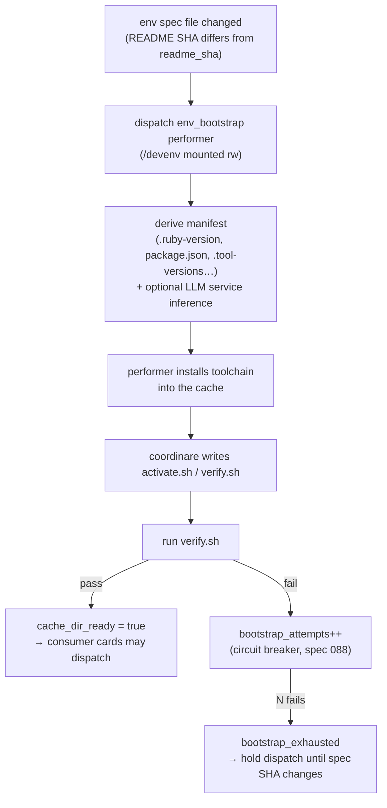
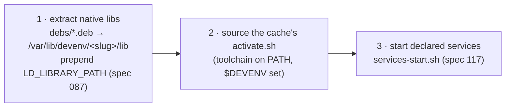

# 06 — Environment Cache

Performers need a **real dev environment** to do real work — the right runtimes, the project's
dependencies, and any services (Postgres, Redis) the tests need. The **env-cache** is the
per-symphony cached environment that makes this fast and repeatable.

## The idea

> Build the project's dev environment **once**, cache it on the host, and **mount it into every
> performer** at `/devenv`. Refresh it only when the project's environment spec changes.

```
~/.coordinare/env-caches/<symphony-slug>/
├── activate.sh          # puts the toolchain on PATH (sourced on activation)
├── verify.sh            # coordinare-rendered checks (did the toolchain install?)
├── debs/                # captured .deb packages
├── services/            # services-{start,health,stop}.sh
├── services-extract/    # extracted service binaries (postgres, redis…)
└── <toolchain dirs>     # rbenv/nvm/etc.
```

- Mounted at `/devenv` — **rw for the bootstrap performer**, **ro for everyone else** (QA,
  implementer…).
- Container path == `/devenv/<slug>`; the slug is `sanitise_symphony_name()` + a short hash.

## Bootstrap flow



1. **Change detection** (`env_cache.check_and_trigger`): coordinare hashes the symphony's
   `env_spec_files` (e.g. `README.md`) each poll; a changed SHA triggers a bootstrap.
2. **Dispatch**: the `env_bootstrap` performer (`symphony.env_bootstrap_performer_id`) runs in a
   container with `/devenv` **rw**.
3. **Manifest derivation** (`env_manifest.py`): parse structured files (`.ruby-version`,
   `.tool-versions`, `.nvmrc`, `package.json`, `Gemfile`…) into pinned runtimes/deps. Optional
   LLM **service inference** reads the README for services documented only in prose.
4. **Install**: the performer installs the toolchain into the cache.
5. **Verify**: coordinare-rendered `verify.sh` confirms the tools/versions are present.
6. **Circuit breaker** (spec 088): N consecutive bootstrap failures for a spec SHA →
   `bootstrap_exhausted` → consumer dispatch is **held** (with a human-readable reason) until the
   spec SHA changes (a README fix) or an operator clears it. This prevents an infinite
   bootstrap-fail loop.

## Activation — what happens when a performer starts

Every performer container sources the coordinare-owned profile (`devenv-profile.sh`) via
`BASH_ENV`, **before any shell command**. Activation does three things, in order:



1. **Deterministic native-lib extraction (spec 087)** — coordinare-owned, *not* trusted to the
   LLM. Extracts `*.so` from cached `.deb`s into a writable lib dir on `LD_LIBRARY_PATH`. (A
   forgetful model can't be relied on to do this in `activate.sh`.)
2. **Source `activate.sh`** — the toolchain (rbenv/nvm/etc.) goes on PATH; `$DEVENV` is set.
3. **Start services (spec 117)** — runs `services-start.sh` once per container.

### Why services start at *activation* (not bootstrap)

Stateful services have **container-local runtime state** (`/tmp/coordinare-services/`), not the
read-only cache mount. The bootstrap container exits; its running Postgres dies with it. So
services must be started **in the performer's own container** — the one whose app-under-test
connects to them — which is exactly what activation does. (This was the fix in spec 117; before
it, services were started in the wrong, soon-to-exit container.)

## Performer-owned vs coordinare-managed services (spec 116)

There's a toggle, **`coordinare_manages_services`**, defaulting to **`false`**:

- **`false` (default — performer owns it):** the env_bootstrap performer installs and sets up
  services itself; coordinare stays out of the deb-fetch/script-rendering/readiness-gating. The
  091→115 "coordinare-managed services" subsystem is dormant code, kept for possible re-enable.
- **`true`:** coordinare injects a deb-fetch persona, renders the service scripts, and gates the
  bootstrap on a `run_service_readiness` check (the pre-116 behavior).

This default was chosen after the coordinare-managed approach proved fragile; letting the
performer own env setup end-to-end is simpler and more robust.

## State & where to look

| Concern | Location |
|---|---|
| Env-cache state (per symphony) | `EnvCacheState` in `src/coordinare/models/env_cache.py` + `coordinare.state.json` |
| Bootstrap orchestration | `src/coordinare/services/env_cache.py` |
| Manifest / verify / activate rendering | `src/coordinare/services/env_manifest.py` |
| Activation profile (in performer image) | `agent/performer/devenv-profile.sh` |
| Toggle + cache root | `EnvCacheConfig` in `src/coordinare/config.py` |

Next: **[07 — Roadmap](07-roadmap.md)**.
</content>
